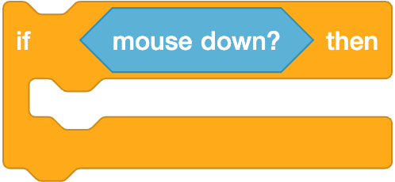
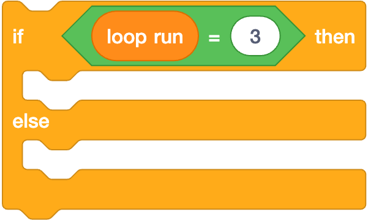
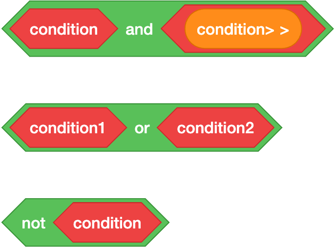

# Scratch Programming Tutorial

Welcome to the Scratch programming tutorial! Scratch is a visual programming language that makes it easy to create interactive stories, games, and animations. In this tutorial, we'll explore some of the fundamental concepts and blocks used in Scratch.

## Understanding Blocks

In Scratch, blocks are the building blocks of your program. They are categorized into different types, each serving a specific purpose. Let's explore some of the key block types:

### Motion Blocks

Motion blocks control the movement of sprites. For example, you can use the "move 10 steps" block to move a sprite forward.

### Sound Blocks

Sound blocks allow you to play sounds and control the volume. You can use these to add audio effects to your projects.

## Repeat Blocks (Iteration/Loops)

Repeat blocks are used to execute a set of instructions multiple times. They are essential for creating loops in your program.

- **Repeat Block**: The "repeat" block repeats the enclosed blocks a specified number of times.

  

- **Forever Block**: The "forever" block repeats the enclosed blocks indefinitely.

  

## If Blocks

If blocks are used to make decisions in your program. They execute a set of instructions only if a specified condition is true.

- **If Block**: Executes the blocks inside if the condition is true.

  

- **If-Else Block**: Provides an alternative set of instructions if the condition is false.

  

## Variables

Variables are used to store data that can be changed during the execution of a program. In Scratch, you can create your own variables to keep track of scores, positions, or any other data.

- **Creating a Variable**: Use the "Make a Variable" button to create a new variable.
- **Set Variable**: Use the "set [variable] to [value]" block to assign a value to a variable.
- **Change Variable**: Use the "change [variable] by [value]" block to modify the value of a variable.

## Data Types

Scratch uses different shapes to represent different data types:

- **Round Blocks**: Represent numbers or strings.

  

- **Hexagon/Boolean Blocks**: Represent true or false values.

  

## Operators

Operators are used to perform operations on data. Scratch provides a variety of operators for arithmetic, comparison, and logical operations.

- **Text Operators**: Concatenate strings.

  

- **Comparison Operators**: Compare two values.

  

- **Logical Operators**: Combine multiple conditions.

  

  ```

  ```

## Conclusion

This tutorial covered the basics of Scratch programming, including blocks, loops, conditionals, variables, data types, and operators. With these tools, you can start creating your own interactive projects in Scratch. Happy coding!
